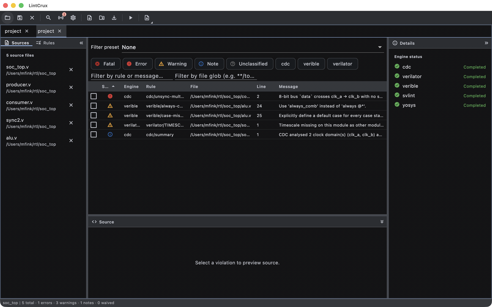

# lintcrux

[](LICENSE)

LintCrux is an RTL lint dashboard: it drives the open-source
Verilog/SystemVerilog/VHDL lint engines you already use, normalizes everything they
emit into one SARIF-backed violation model, and gives you a single triage surface
across all of them. Open core, part of Ferrite Engineering's EDACrux suite.



<sub>LintCrux showing a lint run over that same SoC, with the violations table populated.</sub>

## Status

Public beta. Implemented in this repository today:

- Six engine adapters — Verilator, Verible, Slang, Yosys `check`, GHDL and Svlint —
  each normalizing its output into the common `Violation` model.
- Tabbed multi-project workspace with `project.lintcrux` project files, Vivado-style
  `.f` filelist import, FuseSoC/Edalize EDAM (`.eda.yml`) import, and session
  save/restore.
- Violations dashboard with severity/engine/rule/file filtering, filter presets,
  waivers, severity overrides, and a per-engine rule database.
- Export to SARIF 2.1.0, JSON, CSV and HTML.
- A CXP cross-probe server for the rest of the EDACrux suite.
- A read-only web SARIF viewer built from this same package.
- Update checks, the beta issue reporter, and en/zh_CN/zh/ja/ko localization.

## Pattern reference

`lintcrux` follows the same open-core + Pro/Enterprise overlay pattern as WaveCrux:

- This repository is the open-core viewer/tool.
- The closed-source Pro overlay consumes this repo as a Git submodule
  and depends on it through a pubspec `path: ./lintcrux` entry, layering
  Pro/Enterprise features via a `proOverrides` list spread into the open-core
  `ProviderScope`.

When in doubt about a convention, file layout, naming choice, or architectural seam,
consult the WaveCrux reference implementation. Match its pattern unless this project
has a documented reason to diverge.

## Prerequisites

LintCrux does **not** ship the lint engines. Install whichever ones you want to run
and make sure they are on your `PATH`:

| Engine | Executable LintCrux looks for |
|--------|-------------------------------|
| Verilator | `verilator` |
| Verible | `verible-verilog-lint` |
| Slang | `slang` |
| Yosys | `yosys` (`yosys.exe` on Windows) |
| GHDL | `ghdl` |
| Svlint | `svlint` |

Yosys, GHDL and Svlint are registered but disabled by default for new projects;
enable them per project through `enabledEngineIds`. A missing engine is reported as
unavailable rather than failing the run.

## Build & run

```bash
git submodule update --init --recursive   # crux-shared
flutter pub get
flutter run -d macos      # or -d linux, -d windows
flutter analyze
flutter test
```

## Try it

[`examples/`](examples/README.md) holds ready-to-open projects. Launch LintCrux,
use **File → Open Project…** (`Cmd/Ctrl+O`), pick one, then **Tools → Run All
Engines** (`F5`):

- [`examples/getting-started/`](examples/getting-started/project.lintcrux) — a
  SystemVerilog ALU with 7 findings over 6 rules from Verilator and Verible
  running in parallel, including an inferred `LATCH` and a silent 8-to-4-bit
  `WIDTHTRUNC`. Needs `verilator` and/or `verible-verilog-lint` on `PATH`; an
  engine that is missing is simply skipped.
- [`examples/vhdl-getting-started/`](examples/vhdl-getting-started/project.lintcrux)
  — a VHDL counter whose process variable shadows an architecture signal, so
  GHDL's `--warn-hide` and `--warn-unused` report the same bug twice. Needs
  `ghdl` on `PATH`.

**No engine installed?** Open
[`examples/getting-started/report.sarif`](examples/getting-started/report.sarif)
with **File → Import SARIF report…**. It is a real captured report of the
example above, so the violation table, filters, inspector and click-to-source
all work with nothing on `PATH`.

## Engine binary resolution

Each engine resolves its executable in this order:

1. A per-launch CLI override — `--verilator-path`, `--verible-path`, `--slang-path`,
   `--ghdl-path`, `--svlint-path`, `--yosys-path`.
2. A **Custom** path configured in `Settings → Engines` (session-scoped in open core).
3. `$LINTCRUX_BUNDLED_BIN_DIR/<platform>/<exe>`, when the engine's binary source is
   **Bundled** and that environment variable is set —
   `BundledBinaryResolver` (`lib/services/engines/bundled_binary_resolver.dart`).
4. The bare executable name, resolved by the OS against `PATH`.

**No engine binary ships inside the release distribution today.** With
`LINTCRUX_BUNDLED_BIN_DIR` unset — which is every shipped build — the resolver
returns `null` and every mode falls through to the `PATH` lookup, so choosing
**Bundled** in `Settings → Engines` currently behaves exactly like **Auto-detect**.
Debug and release builds behave identically.

The pinned versions in [`tool/bundled_engines.yaml`](tool/bundled_engines.yaml) and
the [`.github/workflows/bundled-engines.yml`](.github/workflows/bundled-engines.yml)
workflow are preparatory infrastructure for a future bundled-binary release: the
workflow fetches each pinned engine per OS and uploads artifacts, but nothing consumes
them and no release job packages them into the app. Per-platform bundling is *planned*
— docs, website and this README stay on "planned" until it actually ships.

## Running the engine-dependent tests

Most tests run unconditionally with `flutter test`. Tests that exercise a real engine
binary are `skip:`-aware:

- **Per-engine integration tests** (`test/services/engines/*/integration/`) skip when
  the engine binary is not on `PATH` and not in `LINTCRUX_BUNDLED_BIN_DIR`. The skip
  message says exactly which binary is missing.
- **Cross-version engine validation** runs the same fixture set against the current
  (`PATH`) and N-1 engine versions. The N-1 path is supplied via the env vars
  `VERILATOR_NMINUS1_BIN`, `VERIBLE_NMINUS1_BIN`, and `SLANG_NMINUS1_BIN`; when unset,
  the test skips with a clear "set `<VAR>` to enable the N-1 cross-check" message. CI
  does not populate these today, so the N-1 cross-checks skip there.

To enable bundled-binary tests on a contributor machine: download the relevant binaries
(or run the bundled-engines CI workflow and extract its artifacts) and set
`LINTCRUX_BUNDLED_BIN_DIR` to the layout described in
[`tool/bundled_engines.yaml`](tool/bundled_engines.yaml).

## Platform support

| Platform | State | Notes |
|---|---|---|
| Linux | Supported | Primary target. |
| macOS | Supported | macOS 12.0 or later. |
| Windows | Supported | |
| Web | Supported | Read-only SARIF viewer — the lint engines are native binaries and do not run in a browser. |

No mobile build: the engines are native binaries invoked as subprocesses, which a
phone cannot host.

## Contributing

Read [`CONTRIBUTING.md`](CONTRIBUTING.md) first — contributions require a signed
Contributor License Agreement ([`CLA.md`](CLA.md)).
[`docs/ARCHITECTURE.md`](docs/ARCHITECTURE.md) is the engineering reference: tech
stack, architectural rules, and the extension-point seams the Pro overlay plugs
into. User documentation lives at [docs.lintcrux.app](https://docs.lintcrux.app/), and
its source is in [`docs-site/docs/`](docs-site/docs/).

The quality gates, all of which must pass:

```bash
flutter analyze --fatal-infos --fatal-warnings   # zero-warning policy
flutter test
```

Most tests run unconditionally. The ones that drive a real engine binary skip
when it is absent — see
[Running the engine-dependent tests](#running-the-engine-dependent-tests).

## License

LintCrux open core is licensed under the Apache License 2.0. See
[`LICENSE`](LICENSE) for the full text and [`NOTICES`](NOTICES) for
third-party attributions. Contributions require a signed
Contributor License Agreement — see
[`CONTRIBUTING.md`](CONTRIBUTING.md).

Apache-2.0 §6 grants no trademark rights, so the name and logo are
covered separately — see [`TRADEMARK.md`](TRADEMARK.md). Forks are
welcome; they just need a different name.

The lint engines LintCrux drives (Verilator, Verible, Slang, GHDL, Yosys,
Svlint) are **separate programs**, invoked as subprocesses and never linked
into the LintCrux binary. Their own licenses — including the LGPL of
Verilator and the GPL of GHDL — apply to those programs, not to LintCrux.
LintCrux redistributes none of them: it resolves them from `PATH` at run time. If a
bundled-binary distribution path lands later, those binaries would be redistributed
under their own terms and carry their own obligations. See [`NOTICES`](NOTICES) §1.
